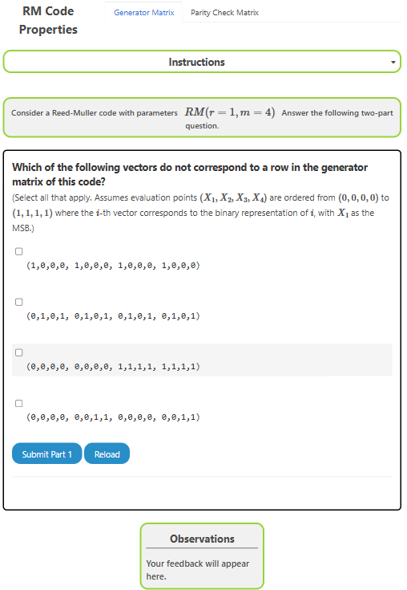
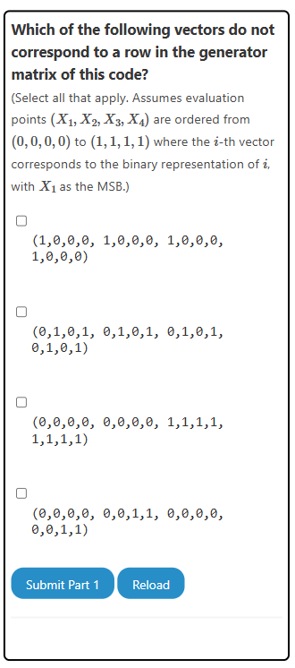
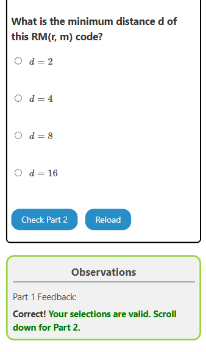
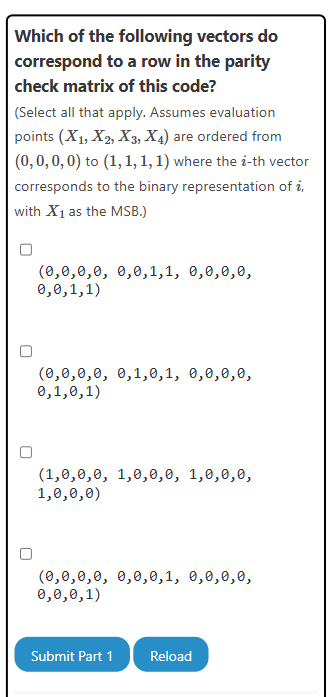
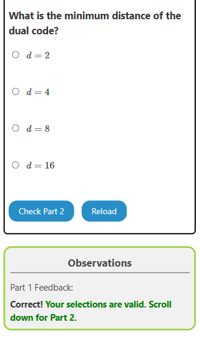

### Procedure

The experiment consists of two tasks. Each task has two subparts. The user is recommended to go through these in the same sequence as they are presented.

1. Identify the vectors not present in the standard generator matrix given RM code, and identifying minimum distance of the code.
2. Identify the vectors present in the standard parity check matrix given RM code, and identifying minimum distance of the dual code.

## Overview of the Experiment window

The experiment window consists of the following components:
1. **Task tab**: The task tab contains the list of tasks that need to be performed in the experiment. The user can navigate to any task by clicking on the corresponding task in the task tab.
2. **Instruction box**: The instruction box displays step-by-step instructions to perform the task.
3. **Question box**: The question box displays the question to be answered by the user.
4. **Observation box**: The observation box displays the feedback messages based on the user's input.
5. **Action box**: The action box contains the input elements and buttons to perform the task.

    

## Experiment:

There are two tasks in this experiment.

### Task 1: Generator Matrix and Minimum Distance of Code

1. Given parameters of RM code, identify the vectors not present in the standard generator matrix of the code.

    

2. Calculate the minimum distance of RM code with given parameter.

    

### Task 2: Parity Check Matrix and Minimum Distance of Dual Code

1. Given parameters of RM code, identify the vectors present in the standard parity check matrix of the code.

    

2. Calculate the minimum distance of the dual of RM code with given parameter.

    

